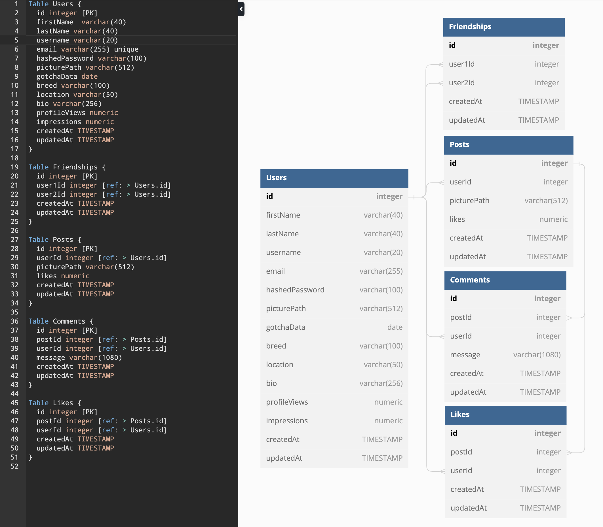

<a name="top"></a>

# Social Pets 
<details>
    <summary><b>Table of Contents</b></summary>
    <ol>
        <li>
            <a href="#project-overview">Project Overview</a>
            <ul>
                <li><a href="#the-opportunity">The Opportunity</a></li>
                <li><a href="#the-solution">The Solution</a></li>
                <li><a href="#built-with">Built With</a></li>
                <li><a href="#features">Features</a></li>
            </ul>
        </li>
        <li>
            <a href="#the-development-process">The Development Process</a>
            <ul>
                <li><a href="#goals">Goals</a></li>
                <li><a href="#technical-highlights">Technical Highlights</a></li>
                <li><a href="#database-schema-design">Database Schema Design</a></li>
                <li><a href="#roadmap">Roadmap</a></li>
            </ul>
        </li>
        <li>
            <a href="#deployment">Deployment</a>
            <ul>
                <li><a href="#remote-deployment">Remote Deployment</a></li>
                <li><a href="#local-deployment">Local Deployment</a></li>
            </ul>
        </li>
    </ol>
</details>

## Project Overview
### The Opportunity
<div>
    <p>Have you ever peeked at your pet cam only to find them bored out of their mind, just waiting for you to get home?</p>
    <a target="_blank" href='https://www.reddit.com/r/WhatsWrongWithYourDog/comments/azujga/'>
        
    </a>
</div>

<div>
    <p>Or have you ever been greeted by a plea of devastation as soon as they realize that you're on your way out?</p>
    <a target="_blank" href='https://www.reddit.com/r/WhatsWrongWithYourDog/comments/9m4a7w'>
        
    </a>
</div>

<div>
    <p>Let's not forget enjoying a well-earned vacation and suddenly receiving a heart-wrenching picture update from your sitter.</p>
    <a target="_blank" href='https://www.reddit.com/r/WhatsWrongWithYourDog/comments/ebosl5/thought_it_would_be_cute_to_get_an_xmas_picture/'>
        
    </a>
</div>

### The Solution
I've been there, and I know many pet parents have been too. Introducing, **Social Pets**! A full-featured social media platform designed to keep our four-legged friends entertained, engaged, and socialized! It offers a space where they can have their own profiles, share their daily antics, and connect with friends. 

DISCLAIMER: While unlikely, there is a chance that your pet may become too engrossed in their new social life to care for fetch and cuddle. We take no responsibility for any emotional damage this may cause you. 😂

### Built With:


### Features:
- Signup
- Login
- Logout
- User profiles
- Create, read, update, and delete posts
- Create, read, update, and delete comments on posts
- Upload images 
- Follow and unfollow other users


<p align="right">(<a href="#top">jump to top</a>)</p>

## The Development Process
### Goals 
- **Full-Stack Development**: This project served as a practical way of solidifying my knowledge of full-stack web development, bridging the gap between conceptual understanding and real-world application.
- **Holistic Design and Implementation**: I sought to immerse myself in the entire development process, from ideation to deployment. This included making nuanced design and implementation decisions across the front-end, back-end, and database layers, drawing from best practices in the industry.
- **Threat Resilience**: A goal was to not only build a functional application, but one that stands resilient against common cyber threats.
- **Stepping into the Shoes of a Software Engineer**: Beyond just coding, the ambition was to think, plan, and execute like a seasoned software engineer from planning to testing.

### Technical Highlights
- **Intuitive Interface**
    - **Modern UI**: Utilized Material UI for an elegant and user-friendly interface with a uniform design ethos.
- **Robust Backend**
    - **Express Backend**: Crafted a powerful Express backend to serve requests seamlessly.
    - **Database**: Paired Express with a PostgreSQL database to ensure data consistency and fast access.
    - **RESTful API**: Structured the server to handle requests conforming to REST constraints.
- **Streamlined Data-flow**
    - **State Management**: Integrated Redux to centralize data flow across the application, promoting consistent and predictable state updates.
    - **Form Management**: Incorporated Formik to simplify data submission processes and manage intricate data validation.
- **Comprehensive Data-Integrity System**
    - **Real-time Front-end Validation**: Leveraged Yup in the front-end for real-time validation of data entry.  
    - **Sequelize-Level Validation**: Used Sequelize validations for server-side validation.
    - **Database-Level Constraints**: Enforced PostgreSQL contraints for database-level validation, completing end-to-end data-integrity system. 
- **Database Design**
    - **Normalzied Schema**: Adopted normalization principles for a logical and efficient database schema and represented it on dbDiagram. 
    - **Implementation**: Codified schema with Sequelize models and migrations.
- **Threat Resilience**
    - **CSRF Defense**: Implemented a stateless double-cookie authentication pattern for all non-GET requests to protect against CSRF threats.
    - **Authorization**: Safeguarded private routes using JWT-based authorization, ensuring only authenticated users access secured resources.

### Database Schema Design
<div align='center'>
    <div>
        <a href='https://www.reddit.com/r/WhatsWrongWithYourDog/comments/ebosl5/thought_it_would_be_cute_to_get_an_xmas_picture/'>
        
        </a>
    </div>
</div>

<p align="right">(<a href="#top">jump to top</a>)</p>


## Roadmap

<p align="right">(<a href="#top">jump to top</a>)</p>


## Deployment
### Remote Deployment
To view the live version of Social Pets, [click here](https://social-pets.onrender.com/). Follow the on-screen instructions to register or log in.

### Local Deployment
Follow these steps to run Social Pets on your local machine for development and testing.

- **Prerequisites**
    - Node.js & NPM
    - PostgreSQL

- **Installing**
    1. Clone the repository to your local machine.
    2. Navigate to the project directory.
    3. Create a `.env` file in `backend` and define the variables below for your PostgreSQL database, your desired JWT parameters, and bcrypt salt to be used for hashing:  
        ```
            PORT=5000
            DB_USERNAME=
            DB_PASSWORD=
            DB_DATABASE=
            DB_HOST=localhost
            JWT_SECRET=
            JWT_EXPIRES_IN=
            BCRYPT_SALT=
        ```
    4. Run `npm install` inside `frontend` to install all required front-end dependencies.
    5. Run `npm start` inside `frontend` to start the front-end.
    6. Run `npm install` inside `backend` to install all required back-end dependencies.
    7. Run `npm start` inside `backend` to start the back-end. 
    8. Run `dotenv npx sequelize db:migrate` inside `backend` to run Sequelize migrations. 
    9. Run `dotenv npx sequelize db:migrate` inside `backend` if you would like to seed the database with mock data.

<p align="right">(<a href="#top">jump to top</a>)</p>
